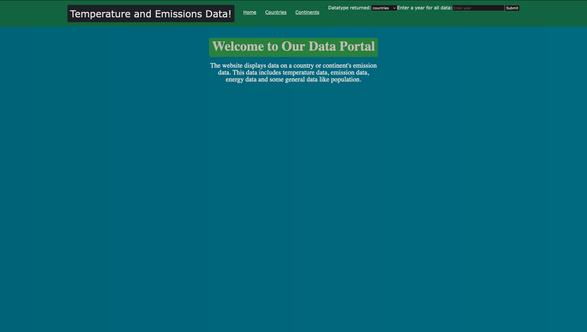
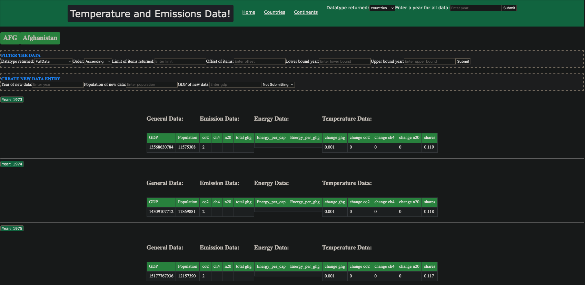
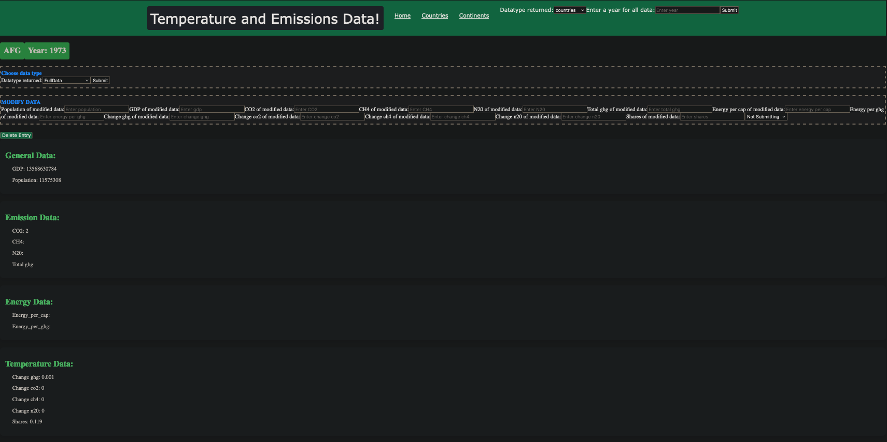

<br />
<p align="center">
  <h1 align="center">Emissions API</h1>

  <p align="center">
    Manos, Cezar, Josefine
  </p>
</p>






## About The Project
This project was done as part of our university project in the Web Engineering course.


This project is about a web application that displays, updates, deletes data from a large dataset which can be found here, https://github.com/owid/co2-data.
We used java for the backend, react for the front-end and mysql as a database to store the data. 


## Getting Started

To get a local copy up and running follow these simple steps.

### Prerequisites

* [Java 17](https://www.oracle.com/java/technologies/javase/jdk17-archive-downloads.html) or higher
* [Maven 3.6](https://maven.apache.org/download.cgi) or higher
* Docker

### Installation

1. Navigate to the `emissions-API` directory
2. Open the Docker application.
3. Run the following command:
```sh
docker compose up -d --build
```

## Running

When the containers are running, navigate to http://localhost:3000/ for the complete web application. If you want to just view the backend navigate to
http://localhost:51417/.

